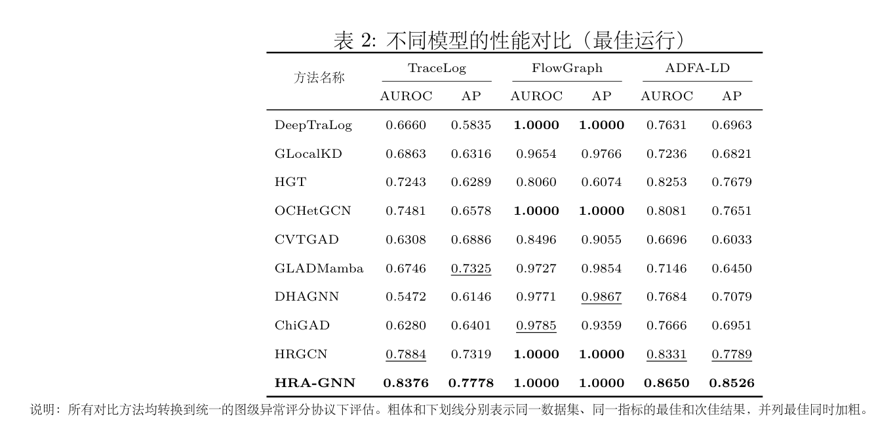
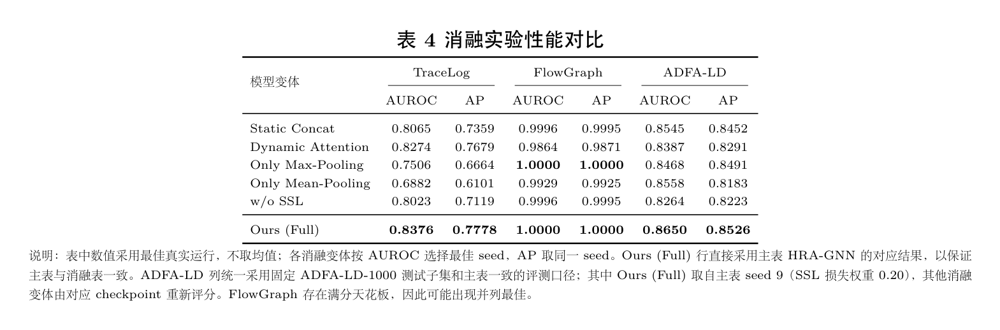
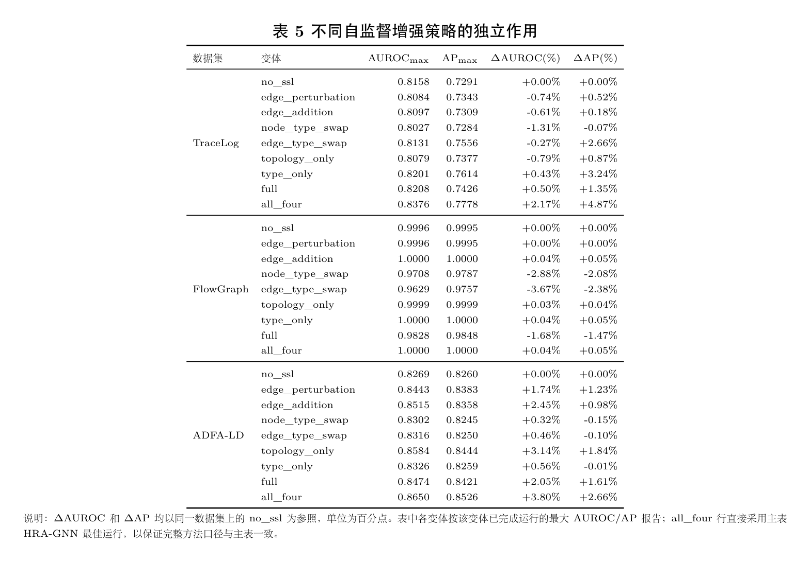

# 4 实验结果与分析

## 4.1 数据集

本文在 TraceLog、FlowGraph 和 ADFA-LD 三个图级异常检测数据集上进行实验。其中，TraceLog 和 FlowGraph 使用 HRGCN 作者发布的预处理异构图；ADFA-LD 由公开 Linux 系统调用轨迹构建为图级异常检测样本。三个数据集分别覆盖微服务调用链路、系统流行为和操作系统调用序列，能够从不同系统场景验证模型对异构结构异常的识别能力。所有实验均采用无监督图级异常检测设置，即训练阶段只使用正常图，异常标签仅用于测试阶段计算评价指标。

TraceLog 数据集来源于微服务系统调用链路场景，是一个面向日志异常检测任务的非对称异构图数据集。每张图对应一条调用轨迹，异常样本主要表现为调用链结构或实体交互模式偏离正常运行轨迹。该数据集包含 8 种节点类型和 4 种显式边类型，节点特征为作者发布数据中的 7 维归一化属性。

FlowGraph 数据集用于刻画网络浏览行为及系统事件之间的异构关联。每个流程图由用户行为、文件操作、网页访问等多类型实体及其连接关系构成。数据集中同时包含正常场景与攻击场景，本文将正常流程图视为正常样本，将由恶意 URL 访问等行为触发的流程图视为异常样本。需要说明的是，FlowGraph 发布文件中边索引不包含显式边类型字段，因此本文复现实验中将其作为 8 种节点类型、1 种显式边类型的数据集处理，发布数据中的 26 维信息作为节点属性使用。

ADFA-LD 数据集由 Linux 系统调用轨迹构成。本文将一条系统调用轨迹文件转换为一张图，一次系统调用出现转换为一个节点，节点顺序与原始系统调用顺序一致。系统调用词表只由正常训练轨迹建立，验证轨迹和攻击轨迹中未见过的系统调用统一映射为 unknown 类型，以避免使用异常样本扩充输入类别空间。该数据集共包含 151 种节点类型，当前实验采用仅按边类型共享关系参数的方式控制模型规模。

表 1 给出了三个数据集的规模、节点类型、边类型和异常比例统计。表 2 给出了训练、验证和测试划分。可以看到，三个数据集的图规模和异常比例差异较大，尤其是 FlowGraph 单图规模远大于其他数据集。因此，本文同时报告 AUROC 和 AP，以分别考察整体排序能力和异常样本排序前置能力。

表 1 数据集统计信息

| 数据集 | 图总数 | 正常图 | 异常图 | 总体异常比例 | 特征维数 | 节点类型数 | 显式边类型数 | 平均节点数 | 平均边数 |
|---|---:|---:|---:|---:|---:|---:|---:|---:|---:|
| TraceLog | 132485 | 109151 | 23334 | 17.61% | 7 | 8 | 4 | 204.633 | 224.008 |
| FlowGraph | 600 | 500 | 100 | 16.67% | 26 | 8 | 1 | 8411.463 | 12730.403 |
| ADFA-LD | 5951 | 5205 | 746 | 12.54% | 8 | 151 | 3 | 461.696 | 1363.159 |

表 2 数据集划分设置

| 数据集 | 训练正常/异常 | 验证正常/异常 | 测试正常/异常 | 测试异常比例 | 划分方式 |
|---|---:|---:|---:|---:|---|
| TraceLog | 65000/0 | 22075/11667 | 22076/11667 | 34.58% | 作者发布划分 |
| FlowGraph | 375/0 | 无 | 125/100 | 44.44% | 作者发布划分 |
| ADFA-LD | 833/0 | 2186/0 | 2186/746 | 25.44% | 官方目录划分 |

训练集全部只包含正常图。TraceLog 的作者 evaluation 划分同时包含正常图和异常图，本文仅使用该划分上的平均 SVDD 损失选择模型，不读取异常标签参与模型训练或参数更新。FlowGraph 没有独立验证集，因此使用训练损失选择模型。ADFA-LD 的验证集只包含正常图。

## 4.2 基准模型

为验证 HRA-GNN 的有效性，本文选取异构图异常检测、日志图异常检测、异构图表示学习和近年图级异常检测方法作为基准模型。所有方法均接入统一的数据划分和评价流程，以保证不同模型在相同输入特征、相同训练数据和相同异常评分口径下进行比较。

OCHetGCN：面向异构图的单类图卷积方法。该模型通过异构消息传递聚合多类型节点邻域信息，并结合 SVDD 进行异常检测。

GLocalKD：基于全局与局部知识蒸馏机制的图异常检测模型。该方法利用一个随机初始化的固定教师网络指导学生网络进行表示学习，通过计算两者在局部节点与全局图表示上的蒸馏残差来量化异常得分。本文将其 GCN 结构替换为 HetGCN 结构，其余模块保持不变，从而使该模型能够适配异构图数据。

HGT：基于 Transformer 的异构图神经网络。该方法通过类型相关参数与多头注意力机制建模异构邻域中的多关系交互，最后采用最大池化策略得到图表示，并结合 SVDD 进行异常检测。

DeepTraLog：一种结合日志特征与图结构信息的异常检测模型。由于本文的问题不引入日志文本信息，因此实验中主要采用其图拓扑建模分支进行对比。

HRGCN：采用关系级特征拼接策略的异构图异常检测模型。该方法对不同关系通道分别建模，并在后续阶段将关系表示直接拼接以生成图表示，最终结合 SVDD 完成图级异常检测。

此外，本文还补充 CVTGAD、GLADMamba、DHAGNN 和 ChiGAD 等 2023 年之后的代表性图级异常检测或异构图异常检测方法作为近年方法对比。

CVTGAD：一种基于跨视图 Transformer 的图级异常检测方法。该方法分别从节点属性视图和结构编码视图学习图表示，并通过跨视图注意力建模两类视图之间的交互关系，最终利用正常图表示分布与测试图表示之间的偏离程度进行异常检测。

GLADMamba：一种引入 Mamba 结构的图级异常检测方法。该方法利用状态空间模型建模图表示中的长程依赖关系，并结合多视图图表示学习机制刻画正常图模式。本文将其作为近年图级异常检测方法接入统一评测流程。

DHAGNN：一种面向动态图级异常检测的方法。该模型强调动态图结构中的局部异常模式与全局图级异常模式，并通过自适应融合机制生成图级异常分数。本文将其用于检验近年动态图异常检测思想在静态系统图数据上的迁移效果。

ChiGAD：一种面向异构图异常检测的方法。该方法通过关系感知的图滤波机制刻画异构关系下的异常模式，适合用于检验关系滤波类异构图异常检测思想在图级异常排序任务中的表现。

为避免测试集信息泄漏，本文固定训练图和测试图，不根据测试 AUROC 选择训练轮次或翻转分数。上述近年方法均接入统一的数据划分、图级表示和异常排序协议。

## 4.3 评价指标

实验采用 AUROC 和 AP 作为主要评价指标。AUROC 用于衡量模型区分正常样本与异常样本的整体排序能力；AP 更关注异常样本是否被排在异常分数序列前部，适合类别不平衡的异常检测场景。本文在测试阶段不需要预先确定阈值，而是根据第 3.3 节得到每张测试图的异常分数，再结合真实标签计算 AUROC 与 AP。

设测试集为 $\mathcal{D}_{test}=\{(G_i,y_i)\}_{i=1}^{N}$，其中 $y_i\in\{0,1\}$，$y_i=0$ 表示正常图，$y_i=1$ 表示异常图；$S_i$ 表示模型对测试图 $G_i$ 给出的异常分数，且分数越大表示图越可能异常。得到所有测试图的异常分数 $\{S_i\}_{i=1}^{N}$ 后，AUROC 可以写成异常图和正常图两两比较的排序概率：

$$
\operatorname{AUROC}=\frac{1}{N_+N_-}\sum_{i:y_i=1}\sum_{j:y_j=0}\left[\mathbf{1}(S_i>S_j)+\frac{1}{2}\mathbf{1}(S_i=S_j)\right]
$$

其中，$N_+$ 和 $N_-$ 分别为测试集中的异常图数和正常图数。该公式表示随机选取一张异常图和一张正常图时，异常图获得更高异常分数的概率。

AP 的计算先按照异常分数从高到低对测试图排序，得到 $S_{(1)}\ge S_{(2)}\ge \cdots \ge S_{(N)}$ 及对应标签 $y_{(k)}$。在前 $k$ 个样本处的精确率为：

$$
P(k)=\frac{\sum_{r=1}^{k}y_{(r)}}{k}
$$

召回率为：

$$
R(k)=\frac{\sum_{r=1}^{k}y_{(r)}}{N_+}
$$

AP 可表示为：

$$
\operatorname{AP}=\sum_{k=1}^{N}[R(k)-R(k-1)]P(k)
$$

等价地，也可写为：

$$
\operatorname{AP}=\frac{1}{N_+}\sum_{k=1}^{N}y_{(k)}\frac{\sum_{r=1}^{k}y_{(r)}}{k}
$$

因此，AP 越高，说明异常图越集中出现在排序前部。

## 4.4 实验结果分析

本文所有方法均采用单类训练协议，训练阶段只使用正常图，测试阶段使用正常图和异常图计算 AUROC 与 AP。HRA-GNN 采用 2 层关系感知消息传递网络，优化器为 Adam，Dropout 设为 0.1，权重衰减设为 $10^{-6}$，梯度裁剪范数设为 5.0。主要超参数的候选空间为：学习率 $\{3\times10^{-5},10^{-4},3\times10^{-4},10^{-3}\}$ 并扩展到 $5\times10^{-3}$，关系偏差调制系数 $\gamma\in\{0,0.05,0.1,0.25,0.5,1,2\}$，SSL 损失权重 $\{0,0.001,0.01,0.1,0.5\}$，注意力温度 $\{0.5,1.0,2.0\}$，关系原型动量 $\{0.5,0.7,0.9,0.99\}$，隐藏维数 $\{64,128,256\}$。

主表实验中，TraceLog 使用 128 维隐藏表示、批大小 16、学习率 $10^{-4}$、SSL 权重 0.001；FlowGraph 使用 32 维隐藏表示、批大小 4、学习率 $10^{-2}$、SSL 权重 0.21；ADFA-LD 使用 128 维隐藏表示、批大小 4、学习率 $10^{-4}$、SSL 权重 0.20。三个数据集均保留完整关系偏差调制模块，$\gamma=1.0$，注意力温度为 1.0，关系原型动量为 0.9。

图 4 和图 5 分别展示不同方法在各数据集上的 AUROC 和 AP 对比。表 3 给出了各个模型在 TraceLog、FlowGraph 和 ADFA-LD 三个数据集上的数值结果。表中每个模型在每个数据集上按 AUROC 选择最佳真实运行，AP 取自同一次运行；粗体表示同一数据集、同一指标的最佳结果，下划线表示次佳结果，并列最佳同时加粗。

表 3 不同模型的性能对比（最佳运行）

从表 3 可以看出，在 TraceLog 数据集上，HRA-GNN 取得 0.8376 的 AUROC 和 0.7778 的 AP，两项指标均为最优。相比 AUROC 次佳的 HRGCN，HRA-GNN 绝对提升 0.0492；相比 AP 次佳的 GLADMamba，HRA-GNN 绝对提升 0.0453。该结果说明，在微服务调用链路场景中，异常往往体现为少数关键关系通道或局部结构模式的偏移，关系偏差调制注意力能够增强模型对异常敏感关系的关注，自适应混合读出也有助于同时保留局部突变和整体分布变化。

在 FlowGraph 数据集上，HRA-GNN、HRGCN、OCHetGCN 和 DeepTraLog 均达到 1.0000 的 AUROC 和 AP。该现象说明 FlowGraph 中正常样本与异常样本之间存在较明显的结构或统计差异，基础图表示模型已经能够较好地区分两类样本。因此，FlowGraph 上的满分结果不能单独证明复杂关系建模模块的必要性，更适合作为模型能否稳定利用大规模异构图信号的验证。

在 ADFA-LD 数据集上，HRA-GNN 获得 0.8650 的 AUROC 和 0.8526 的 AP，优于次佳 HRGCN 的 0.8331 和 0.7789。该结果表明，在系统调用轨迹场景中，HRA-GNN 能够捕获系统调用图中的结构依赖，对攻击轨迹具有较好的整体排序能力。

## 4.5 消融实验分析

为验证所提模型各模块的作用，本文在 TraceLog、FlowGraph 和 ADFA-LD 三个数据集上进行消融实验。消融设置保留原稿设计，包括 Static Concat、Dynamic Attention、Only Max-Pooling、Only Mean-Pooling 和 w/o SSL 五类变体。其中，Static Concat 使用静态关系拼接替代动态关系融合；Dynamic Attention 只保留关系语义注意力，不使用关系偏差强度调制；Only Max-Pooling 和 Only Mean-Pooling 分别只保留最大池化或均值池化；w/o SSL 去除自监督增强分支。表 4 给出消融结果。

表 4 消融实验性能对比

由表 4 可以看出，在关系融合部分，Static Concat、Dynamic Attention 与完整模型构成了由静态融合到动态融合再到偏差感知融合的对比。以 TraceLog 为例，Static Concat 的 AUROC 和 AP 分别为 0.8065 和 0.7359；引入动态关系注意力后，性能提升至 0.8274 和 0.7679；完整模型进一步达到 0.8376 和 0.7778。这说明仅对不同关系通道自适应加权已经能够缓解静态拼接难以区分关系重要性的局限，而关系原型偏差建模能够进一步强化模型对异常关系通道的感知能力。

在图级读出部分，Only Max-Pooling 和 Only Mean-Pooling 均低于完整模型。TraceLog 上 Only Max-Pooling 明显优于 Only Mean-Pooling，说明局部关键异常信号对该数据集较为重要；ADFA-LD 上两类单一读出各有优势，但完整模型仍取得最高 AUROC 和 AP，说明自适应门控混合读出能够同时兼顾局部突变和全局分布偏移。FlowGraph 存在明显满分天花板，Only Max-Pooling 与完整模型均达到 1.0000。

去除自监督分支后，HRA-GNN 在 TraceLog 上由 0.8376/0.7778 降至 0.8023/0.7119，在 ADFA-LD 上由 0.8650/0.8526 降至 0.8264/0.8223，说明自监督增强分支可以为单类训练提供额外结构判别信号，缓解仅使用 SVDD 目标时表示过度收缩的问题。FlowGraph 上 w/o SSL 仍接近满分，进一步说明该数据集本身具有较强可分性。

> 新增小结：自监督方法的消融
表 5 不同自监督增强策略的独立作用

## 4.6 参数敏感性分析

本节保留原文安排，由作者后续根据论文整体修改统一处理。
