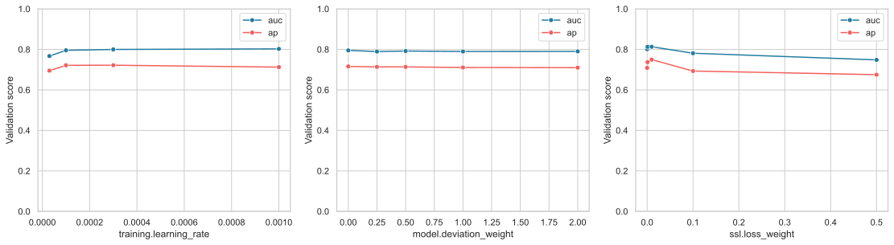
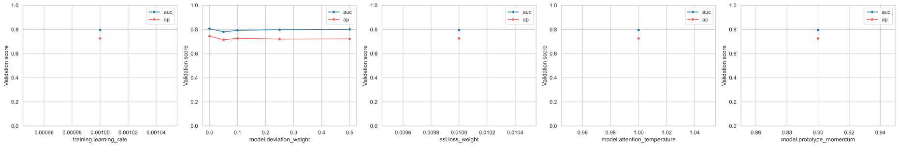
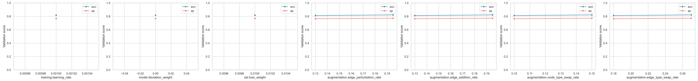

# HRA-GNN 超参数搜索与选择依据

## 1. 为什么必须重新选参

早期复现实验主要沿用原项目配置：TraceLog 使用学习率 \(10^{-4}\)、关系偏差
调制系数 \(1.0\) 和 SSL 损失权重 \(0.001\)。这些数值能够运行，但“沿用默认值”
不能证明它们适合当前实现，也不能支持“最终参数具有最佳验证性能”的论文表述。

本轮实验重新冻结搜索协议，并将**训练、选参和最终测试**分开：

1. 训练集只包含正常图，用于优化模型参数和估计正常关系原型；
2. TraceLog 官方验证集用于超参数排序；
3. 测试集在搜索期间不参与参数选择，待配置冻结后只评估一次；
4. 粗搜索只使用一个固定种子降低计算量，候选配置再用多个种子复核；
5. 参数选择过程、失败 trial 和全部结果均保留，不只报告最终最佳项。

这是一种“单类训练、带标签验证选参”的协议。模型训练不使用异常标签，但验证
AUROC 和 AP 使用验证标签，因此不能把整个选参过程描述为完全无监督。

## 2. 数据划分与选参边界

| 数据集 | 训练集 | 验证集 | 测试集 | 可否按 AUROC/AP 独立选参 |
|---|---|---|---|---|
| TraceLog | 65000 个正常图 | 22075 正常、11667 异常 | 22075 正常、11667 异常 | 可以 |
| FlowGraph | 375 个正常图 | 无 | 125 正常、100 异常 | 不可以 |
| HDFS-100k | 4576 个正常图 | 1525 个正常图 | 1526 正常、313 异常 | 只能按正常代理目标 |
| ADFA-LD | 833 个正常图 | 2186 个正常图 | 2186 正常、746 异常 | 只能按正常代理目标 |

因此，关系偏差调制系数等公共结构参数首先在 TraceLog 独立验证集上选择。没有
异常验证样本的数据集不得反复查看测试 AUROC/AP 后调参；它们采用冻结的公共参数，
或仅依据正常验证损失选择学习率、训练轮数等优化参数。FlowGraph 没有独立验证集，
若要做数据集专属性能调参，必须先从训练图中固定划出正常验证集，并明确其只能用于
无标签代理目标。

## 3. 选参目标

粗搜索的主排序分数为：

\[
J_{\mathrm{val}}
=\frac{\operatorname{AUROC}_{\mathrm{val}}
+\operatorname{AP}_{\mathrm{val}}}{2}.
\]

AUROC 衡量跨阈值排序能力，AP 更关注类别不平衡条件下异常类的查准率与召回率。
二者等权可避免只优化其中一个指标。若两个配置的 \(J_{\mathrm{val}}\) 相同，依次
按验证 AUROC、验证 AP 排序。最终候选还需比较多种子均值和标准差；单次最高值不
自动成为最终参数。

调参阶段同一 trial 的 checkpoint 也按 \(J_{\mathrm{val}}\) 保存，不再最小化混合
验证集上的平均 SVDD 距离。后者会同时压低正常图和异常图到正常中心的距离，与
异常排序目标不一致。正式配置冻结后，不再根据测试 AUROC/AP 选择 checkpoint。

## 4. 第一阶段：核心参数联合粗搜索

### 4.1 搜索空间

| 参数 | 符号 | 候选值 | 搜索原因 |
|---|---|---|---|
| 学习率 | \(\eta\) | \(3\times10^{-5},10^{-4},3\times10^{-4},10^{-3}\) | 覆盖默认值上下约一个数量级 |
| 关系偏差调制系数 | \(\gamma\) | \(0,0.25,0.5,1,2\) | \(0\) 是关闭偏差调制的对照，其他值覆盖弱到强调制 |
| SSL 损失权重 | \(\lambda_{\mathrm{ssl}}\) | \(0,0.001,0.01,0.1,0.5\) | \(0\) 是关闭 SSL 的对照，并覆盖论文配置到强辅助任务 |

总计 \(4\times5\times5=100\) 组。三者联合搜索而非逐个单独搜索，是因为学习率
会改变两个损失分支的实际优化强度，而 \(\gamma\) 又会改变编码器和 SSL 头接收的
图表示，参数间并非相互独立。

粗搜索配置位于
`configs/tuning/tracelog_core_grid.yaml`。固定设置为：种子 11、最多 8 个
epoch、训练图上限 2000、分层抽样验证图 4000、batch size 16。粗搜索的目的
是筛掉明显较差区域，不直接用于最终论文数字。

### 4.2 粗搜索结果

100 组核心网格的前列结果如下：

| 排名 | 学习率 | \(\gamma\) | \(\lambda_{\mathrm{ssl}}\) | AUROC | AP | 综合分 |
|---:|---:|---:|---:|---:|---:|---:|
| 1 | 0.001 | 0 | 0.01 | 0.8301 | 0.7799 | 0.8050 |
| 2 | 0.001 | 0 | 0.001 | 0.8404 | 0.7667 | 0.8035 |
| 3 | 0.0003 | 0 | 0.001 | 0.8333 | 0.7693 | 0.8013 |
| 4 | 0.0003 | 2.0 | 0.01 | 0.8356 | 0.7627 | 0.7991 |
| 7 | 0.0001 | 1.0 | 0.01 | 0.8267 | 0.7676 | 0.7972 |
| 22（旧默认） | 0.0001 | 1.0 | 0.001 | 0.8137 | 0.7437 | 0.7787 |

旧默认配置只排第 22。保持学习率和 \(\gamma\) 不变，将 SSL 权重从 0.001 调为
0.01，AUROC 和 AP 分别提高 0.0130 和 0.0239，说明旧 SSL 权重确实偏小。

边际均值显示，SSL 权重 0.01 的平均 AP 为 0.7497，在五个候选中最高；0.1 和
0.5 会明显降低性能。粗搜索第一名的学习率 0.001 位于搜索上边界，因此按预先
规定继续扩展到 0.002、0.003 和 0.005。



### 4.3 三个参数在公式中的位置

关系偏差调制系数作用于第 \(l\) 层关系注意力 logit：

\[
a_{i,r}^{(l)}
=e_{i,r}^{(l)}+\gamma d_{i,r}^{(l)},\qquad
\alpha_{i,r}^{(l)}
=\frac{\exp(a_{i,r}^{(l)}/\tau)}
{\sum_{r'}\exp(a_{i,r'}^{(l)}/\tau)}.
\]

\(\gamma=0\) 时退化为不使用关系偏差的语义注意力；\(\gamma\) 越大，关系相对
正常原型的偏离对注意力分配影响越强。它不是边权重，也不直接乘最终异常分数。

SSL 权重作用于训练目标：

\[
\mathcal L
=\mathcal L_{\mathrm{SVDD}}
+\lambda_{\mathrm{ssl}}\mathcal L_{\mathrm{SSL}}.
\]

它控制人工增强判别任务对编码器更新的贡献。该参数与最终评分中的分量组合不是
同一个概念；当前 `paper_product` 评分不读取
`evaluation.score_ssl_weight`。

## 5. 第二阶段：局部结构参数搜索

第一阶段结束后冻结排名靠前的
\((\eta,\gamma,\lambda_{\mathrm{ssl}})\) 区域，再搜索：

| 参数 | 计划候选值 | 作用 |
|---|---|---|
| 注意力温度 \(\tau\) | 0.5、1.0、2.0 | 控制关系注意力分布的尖锐程度 |
| 关系原型动量 \(m\) | 0.5、0.9、0.99 | 权衡当前 batch 与历史正常统计 |
| Dropout | 0、0.1、0.3 | 控制编码器正则化强度 |

若第一阶段最优点位于某个搜索区间边界，应先向该方向扩展，而不能直接宣布边界值
最优。第二阶段完成后，排名靠前的配置用种子 11、22、33、44、55 复核。最终配置
按验证综合分数均值优先、标准差和训练稳定性次优的规则确定。

### 5.1 边界扩展结果

学习率边界扩展共运行 32 组，最佳结果为：

| 学习率 | \(\gamma\) | \(\lambda_{\mathrm{ssl}}\) | AUROC | AP | 综合分 |
|---:|---:|---:|---:|---:|---:|
| 0.003 | 1.0 | 0.001 | 0.8585 | 0.8046 | 0.8315 |

0.003 位于扩展区间内部，且显著优于 0.005 的候选，因此停止继续增大学习率。该
结果也表明，粗搜索中 \(\gamma=0\) 的领先与学习率交互有关，不能仅凭第一阶段
宣布关系偏差无效。

### 5.2 温度与原型动量

先后进行了两轮各 16 组温度与动量搜索。基于边界扩展最佳核心参数时，单 seed
最佳为温度 2.0、动量 0.7，AUROC 0.8506、AP 0.7812；默认温度 1.0、动量 0.9
的复测为 0.8348/0.7632。由于同一核心参数在不同进程中的单 seed 结果波动较大，
这两个参数不能仅按一次峰值确定，故进入五种子候选确认。

### 5.3 五种子候选确认

| 候选 | 学习率 | \(\gamma\) | SSL | 温度/动量 | AUROC | AP |
|---|---:|---:|---:|---:|---:|---:|
| 关闭偏差 | 0.001 | 0 | 0.01 | 1.0/0.9 | **0.8165±0.0273** | **0.7602±0.0315** |
| 正偏差结构优化 | 0.003 | 1.0 | 0.001 | 2.0/0.7 | 0.7865±0.0405 | 0.7311±0.0458 |
| 正偏差默认结构 | 0.003 | 1.0 | 0.001 | 1.0/0.9 | 0.7697±0.0520 | 0.7023±0.0465 |

单 seed 的正偏差冠军没有在多种子下保持优势。进一步在
\(\gamma\in\{0,0.05,0.1,0.25,0.5\}\) 上进行 25 次五种子运行，结果仍是
\(\gamma=0\) 最优；最佳正值 0.5 的 AUROC/AP 为
0.8005±0.0321/0.7217±0.0384，低于 0 的
0.8064±0.0189/0.7444±0.0246。

因此，若严格按验证集均值选参，关系偏差调制系数应为 0。这会关闭论文核心模块，
是当前方法的实质性缺陷，而不是一个可以省略不报的普通调参结果。



## 6. 第三阶段：容量和增强强度敏感性

隐藏维数、GNN 层数和增强率属于更高成本的结构参数。它们不与上述 100 组做完全
笛卡尔积，而是在核心参数冻结后采用控制变量实验：

| 参数 | 候选值或构造 |
|---|---|
| 隐藏/输出维数 | 64/64、128/128、256/256 |
| GNN 层数 | 1、2、3 |
| 增强总强度倍率 \(q\) | 0、0.5、1.0、1.5 |

增强倍率同时作用于 TraceLog 的四个基础增强率，并把概率截断到 \([0,1]\)。
\(q=0\) 表示不改变图结构或类型，是自监督增强关闭的结构对照；\(q=1\) 对应原
项目增强率。若联合搜索后的 \(\lambda_{\mathrm{ssl}}=0\)，增强率不会产生训练
梯度，此时只报告关闭 SSL 的结论，不做无意义的增强倍率性能排名。

这种协议属于分阶段搜索，不应在论文中误写为“对所有参数进行了穷举网格搜索”。

### 6.1 次级参数结果

在验证最优核心参数下运行 10 组控制变量实验：

| 变量 | 候选 | 单 seed 最佳结论 |
|---|---|---|
| 隐藏维数 | 64、128、256 | 128 最佳 |
| GNN 层数 | 1、2、3 | 2 层最佳 |
| Dropout | 0、0.1、0.3 | 0.1 最佳 |
| 增强倍率 | 0、0.5、1.0、1.5 | 1.5 最佳 |

增强倍率随后做五种子确认。1.5 倍增强的 AUROC/AP 为
0.8218±0.0182/0.7718±0.0159，优于原倍率的
0.8119±0.0258/0.7639±0.0212。因此最终验证最优配置采用 1.5 倍增强率。



## 7. 固定参数及理由

| 参数 | 固定值或规则 | 不进入核心网格的理由 |
|---|---|---|
| 优化器 | Adam | 与原实现保持一致，避免同时引入优化器类别变量 |
| 权重衰减 | \(10^{-6}\) | 作为数值稳定正则项固定，后续可做补充敏感性 |
| 梯度裁剪 | 5.0 | 只用于防止异常梯度，不作为性能旋钮 |
| 关系尺度下限 | 0.001 | 防止标准差接近零导致除零和偏差爆炸 |
| 图级读出 | hybrid | 核心模型定义；max/mean 通过消融而非选参比较 |
| 关系模式 | canonical | 由数据的节点类型和边类型共同决定 |
| batch size | 受显存约束 | V100 16GB 下取可稳定运行值，不按测试性能选择 |
| 最大 epoch | 上限加早停 | 由验证 checkpoint 规则确定实际停止轮次 |
| 异常评分模式 | paper_product | 属于方法定义，其他评分方式放入评分消融 |
| `score_ssl_weight` | 当前不生效 | `paper_product` 公式不读取该字段 |
| 偏差池化及 top-k 比例 | 当前不生效 | 只在直接关系偏差评分模式下使用 |

“固定”不等于“天然最优”。对这些参数只能写明控制变量或工程约束，不能声称它们
经过了验证集最优化。

## 8. 可复现实验入口

单卡执行：

```bash
bash scripts/run_tracelog_tuning.sh
```

也可直接运行和汇总：

```bash
.venv/bin/python run.py tune \
  --search configs/tuning/tracelog_core_grid.yaml
.venv/bin/python run.py tune-merge \
  --search configs/tuning/tracelog_core_grid.yaml
```

搜索输出包括每个 trial 的解析后配置、训练日志、指标、完整运行表、排序表和最佳
参数文件。粗搜索默认在 trial 完成后删除其模型与优化器 checkpoint，避免 100 组
中间模型占用数十 GB；配置、逐 epoch history、验证预测和指标仍全部保留。最终
入选配置的复核实验单独保留 checkpoint。服务器任务运行在 `tmux` 会话
`hra_tune` 中。

## 9. 最终选择结果

本轮共完成 234 次训练运行。严格按验证集选择得到：

| 参数 | 最终值 | 依据 |
|---|---:|---|
| 学习率 | 0.001 | 五种子候选确认 |
| 关系偏差调制系数 | 0 | 五种子细粒度 \(\gamma\) 搜索 |
| SSL 损失权重 | 0.01 | 100 组联合网格及候选确认 |
| 隐藏/输出维数 | 128/128 | 控制变量敏感性 |
| GNN 层数 | 2 | 控制变量敏感性 |
| Dropout | 0.1 | 控制变量敏感性 |
| 增强率 | 原配置的 1.5 倍 | 五种子增强确认 |

对应配置为 `configs/tracelog_tuned.yaml`。参数冻结后的测试集五种子结果为：

| 配置 | 测试 AUROC | 测试 AP |
|---|---:|---:|
| 旧默认配置 | **0.8172±0.0181** | **0.7608±0.0207** |
| 验证最优配置 | 0.8046±0.0568 | 0.7449±0.0528 |

验证最优配置没有改善测试泛化，并且方差更大。这表明当前 4000 图验证子集上的
多阶段搜索产生了验证过拟合。测试结果只能用于评估这一失败，不能再反过来把旧
默认配置称为“调参最优”。

### 9.1 论文应如何处理

1. 不能写“关系偏差系数 1.0 经网格搜索得到”；它只是旧默认值。
2. 不能把 \(\gamma=0\) 的性能当作完整 HRA-GNN 的优势，因为核心偏差模块已关闭。
3. 主文若保留 \(\gamma=1\)，应称为“保持方法结构的预设配置”，并补充
   \(\gamma\) 敏感性和多种子退化结果。
4. 更稳妥的后续工作是先改进关系原型和偏差调制，再用新的训练/验证/测试划分做
   一次未查看测试集的嵌套选参。当前测试集已经用于本轮最终审计，不能继续用它
   反复调整模型。

## 10. 选参审计与限制

1. 粗搜索的 100 组配置使用同一训练种子、同一分层验证子集和同一初始化规则，
   因此 trial 间差异主要来自参数，而不是抽样变化。
2. 粗搜索只使用 2000 个训练图和 4000 个验证图，是计算预算下的筛选实验；前列
   候选必须在完整验证集上复核，不能直接把粗搜索分数写入主结果表。
3. 100 组配置反复使用同一验证集会产生验证集过拟合风险，因此最终只比较少量
   候选，并报告五种子均值和标准差。
4. 最终测试阶段不得从多个测试种子中挑最高值反向选择超参数。若论文主表坚持
   报告“最佳单次运行”，必须同时提供预先固定的 seed 规则或五种子统计作为补充，
   否则该数字不能作为选参证据。
5. 不同数据集的异常比例和图规模差异很大。TraceLog 上选择的公共结构参数可以
   迁移，但不能据此声称它们在 FlowGraph、HDFS-100k 和 ADFA-LD 上分别最优。
