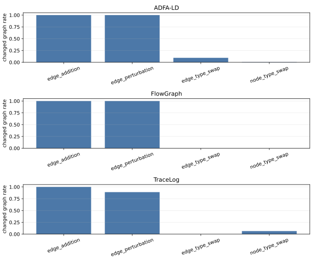

# 自监督增强策略独立作用分析与实验设计

> 对应专家意见：专家2第6点，“建议分析不同自监督增强策略的独立作用，说明它们对模型性能的具体贡献。”

## 1. 要回答的问题

当前论文只说明 HRA-GNN 使用自监督增强分支，但没有拆开说明每一种增强分别解决什么问题、是否真的改变了输入图、以及对最终 AUROC/AP 的贡献。因此需要补充一个独立实验，回答三个层次的问题：

1. **有效性**：某种增强在给定数据集上是否真的改变了图，而不是因为类型约束退化成近似原图。
2. **独立贡献**：只保留一种增强时，模型相对 `no_ssl` 能提高多少 AUROC/AP。
3. **组合收益**：结构类增强、类型类增强和完整增强之间是否存在互补，完整配置是否优于单一增强。

## 2. 增强策略含义

| 策略 | 代码名 | 作用对象 | 预期学习信号 |
|---|---|---|---|
| 边扰动 | `edge_perturbation` | 改变边的目标节点，保持目标节点类型 | 局部邻接关系是否异常 |
| 边添加 | `edge_addition` | 按已有关系模板添加边 | 冗余连接、伪连接和局部拓扑密度变化 |
| 节点类型交换 | `node_type_swap` | 交换部分节点类型 | 节点语义与邻域关系的一致性 |
| 边类型交换 | `edge_type_swap` | 交换部分边类型 | 关系语义与端点类型的一致性 |

注意：`augmentation.methods` 表示每次增强时从候选方法中随机选一种，而不是把所有方法顺序叠加到同一张图上。因此独立消融必须显式把 `augmentation.methods` 设成单元素列表。

## 3. 先做增强有效性审计

在正式训练前，先抽样原图并实际执行四类增强，统计增强后的图是否真的变化。该审计不训练模型，只验证增强操作本身。



审计命令：

```bash
.venv/bin/python scripts/audit_ssl_augmentations.py --sample-size 200
```

输出文件：

```text
reference_results/ssl_augmentation_audit_raw.csv
reference_results/ssl_augmentation_audit_summary.csv
reference_results/ssl_augmentation_audit_summary.tex
doc/assets/ssl_augmentation/ssl_augmentation_changed_rate.svg
```

当前 200 图抽样审计结论：

| 数据集 | 主要现象 | 对实验解释的影响 |
|---|---|---|
| TraceLog | `edge_perturbation` 和 `edge_addition` 有效；`node_type_swap` 只有 6.5% 图发生变化；`edge_type_swap` 当前几乎无效 | TraceLog 上结构增强更可能贡献性能，类型增强若提升不明显有机制解释 |
| FlowGraph | `edge_addition` 和 `edge_perturbation` 有效；`node_type_swap` 与 `edge_type_swap` 基本无效 | FlowGraph 显式边类型只有 1 类，类型类增强不应被包装成关键贡献 |
| ADFA-LD | `edge_perturbation` 和 `edge_addition` 有效；`node_type_swap` 因节点类型退化几乎无效；`edge_type_swap` 只有少量变化 | ADFA-LD 的有效 SSL 信号主要来自系统调用图的拓扑扰动，而不是节点类型扰动 |

这一步能避免一个常见问题：如果某种增强在数据集上根本不改变图，那么它在训练消融中“无贡献”不是模型缺陷，而是数据表示和 schema 约束共同导致的。

## 4. 训练消融设计

新增三个 suite：

```text
configs/experiments/ssl_augmentation_tracelog.yaml
configs/experiments/ssl_augmentation_flowgraph.yaml
configs/experiments/ssl_augmentation_adfa_ld.yaml
```

每个 suite 使用 3 个 seed：

```text
11, 22, 33
```

实验变体：

| 变体 | 设置 | 用途 |
|---|---|---|
| `no_ssl` | 关闭 SSL 分支，评分切回 SVDD | 作为无增强参照 |
| `edge_perturbation` | 仅边扰动 | 单独评估局部重连贡献 |
| `edge_addition` | 仅边添加 | 单独评估额外边贡献 |
| `node_type_swap` | 仅节点类型交换 | 单独评估节点语义错配贡献 |
| `edge_type_swap` | 仅边类型交换 | 单独评估关系语义错配贡献 |
| `topology_only` | 边扰动 + 边添加 | 汇总结构增强贡献 |
| `type_only` | 节点类型交换 + 边类型交换 | 汇总类型/语义增强贡献 |
| `full` | 数据集默认完整增强 | 与论文主配置对齐 |
| `all_four_diagnostic` | 四种增强全部候选 | 仅 FlowGraph/ADFA-LD 诊断，检查引入额外增强是否有害 |

运行命令：

```bash
.venv/bin/python run.py experiment --suite configs/experiments/ssl_augmentation_tracelog.yaml
.venv/bin/python run.py experiment --suite configs/experiments/ssl_augmentation_flowgraph.yaml
.venv/bin/python run.py experiment --suite configs/experiments/ssl_augmentation_adfa_ld.yaml
```

ADFA-LD 的主表使用固定 ADFA-LD-1000 混合评分，因此训练完成后还应对 ADFA-LD 各 checkpoint 追加同协议重评分：

```bash
.venv/bin/python run.py adfa-hybrid-rescore \
  --config <run_dir>/config.yaml \
  --checkpoint <run_dir>/checkpoints/best.pt \
  --fixed-test-ids configs/splits/adfa_ld_fixed_test_1000.txt \
  --unigram-weight 0.5 \
  --markov-weight 0.25 \
  --markov-order 3
```

## 5. 结果表应如何计算

主结果表建议报告每个数据集、每个变体的：

```text
AUROC mean ± std
AP mean ± std
ΔAUROC vs no_ssl
ΔAP vs no_ssl
```

同时保留 `best real run` 作为附表，不要把 AUROC 和 AP 分别从不同 seed 里挑出来。专家意见问的是“独立作用”，所以均值和方差比单个最好 seed 更适合说明稳定贡献。

推荐判据：

| 判据 | 解释 |
|---|---|
| 单一增强相对 `no_ssl` 的 ΔAP/ΔAUROC | 该增强是否独立有用 |
| `topology_only - no_ssl` | 结构增强总贡献 |
| `type_only - no_ssl` | 类型/关系语义增强总贡献 |
| `full - max(single)` | 多增强是否互补 |
| 审计改变图比例 | 若性能无提升，用于解释增强是否实际生效 |

## 6. 可写入论文的分析模板

实验完成后可以按如下逻辑写入论文：

> 为分析自监督增强策略的独立作用，本文分别保留一种增强策略训练 HRA-GNN，并与关闭 SSL 分支的 `no_ssl` 变体比较。边扰动和边添加主要改变局部拓扑结构，用于模拟异常邻域和伪连接；节点类型交换和边类型交换主要制造类型/关系语义错配，用于约束异构关系一致性。进一步地，本文将边扰动与边添加合并为 `topology_only`，将节点类型交换与边类型交换合并为 `type_only`，以区分结构增强和语义增强的总贡献。

如果最终结果符合当前审计预期，可写：

> 增强有效性审计显示，FlowGraph 与 ADFA-LD 中部分类型类增强受数据表示限制，实际改变图的比例接近 0，因此其独立性能贡献有限。相比之下，边扰动和边添加在三个数据集上都能稳定改变图结构，是主要的自监督训练信号来源。这说明 HRA-GNN 的 SSL 分支主要通过约束局部拓扑一致性改善异常排序，而类型语义增强的贡献依赖于数据集中是否存在足够丰富的节点/边类型。

## 7. 已加入的论文附件表

以下 TEX 表已经加入统一大合集：

```text
reference_results/ssl_augmentation_experiment_plan.tex
reference_results/ssl_augmentation_audit_summary.tex
```

重新生成全部表格：

```bash
.venv/bin/python scripts/build_ssl_augmentation_tables.py
.venv/bin/python scripts/render_all_tex.py
```

输出位置：

```text
output/pdf/all_latex_tables.pdf
output/pdf/tables/ssl_augmentation_experiment_plan.pdf
output/pdf/tables/ssl_augmentation_audit_summary.pdf
doc/assets/tables/ssl_augmentation_experiment_plan.svg
doc/assets/tables/ssl_augmentation_audit_summary.svg
```
